Formulario

Comienzo probando el nombre y el apellido, ambos utilizan la misma función con la misma expresión regular, ya que tienen las mismas restricciones (Sólo puede tener entre 2 y 15 carácteres, no puede contener números).

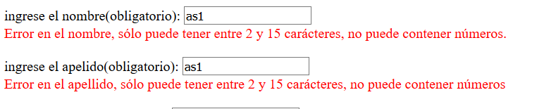

Ahi se puede comprobar que al poner un número da error en la validación.
Tras ello, coloco un nombre correcto y le doy a enviar, quitandome el error.

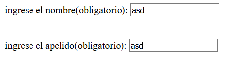

Ahora, compruebo el email, para ello escribo un email incorrecto, ya que para que sea correcto ha de terminar en @pufo.es

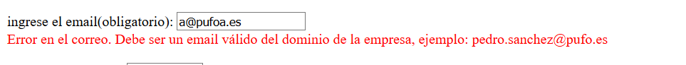

Ahora escribo un email correcto.

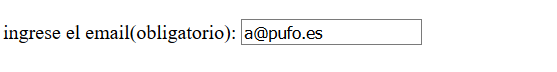

Para validar la fecha de contratación y sea correcta ha de ser una fecha superior al año 2000 e inferior al día actual.
Esta fecha es erroenea ya que el día que la probaba era día 30, por tanto era una fecha superior a la fecha actual.

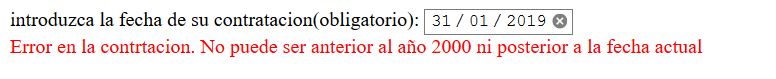

Tras ello pruebo con la fecha actual, la cual es correcta.

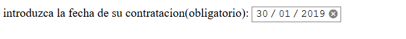

Ahora compruebo el telfono, introduciendo un numero que contiene los digitos pero empieza por uno erroneo.

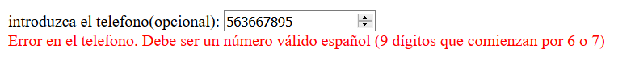

Tras ello cambio el primer dígito para comprobar que valida correctamente.

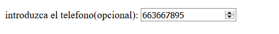

Ahora compruebo el salario, para que sea valido no puede ser menor que el salario mínimo (858,55€) ni mayor que el del CEO (12.000€). Por tanto compruebo con un salario por debajo y otro por encima.

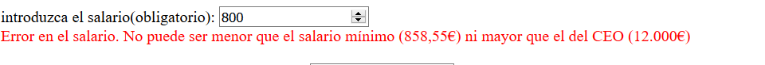
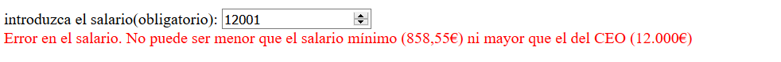

Ahora pongo un salario en el rango correcto.

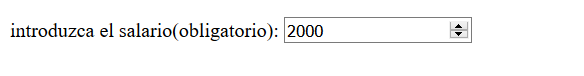

Para que la contraseña sea valida debe tener al menos ocho caracteres y contener al menos una letra minúscula, una mayúscula, un número y un símbolo, además, ambas contraseñas han de ser iguales, la de validación y la que colocas en el campo contraseña. Comienzo comprobando una contraseña erronea.

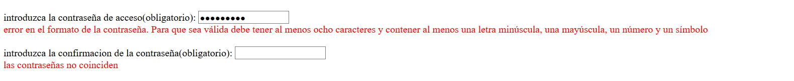

Ahora coloco una correcta, y coloco esa contraseña en el campo de confirmación

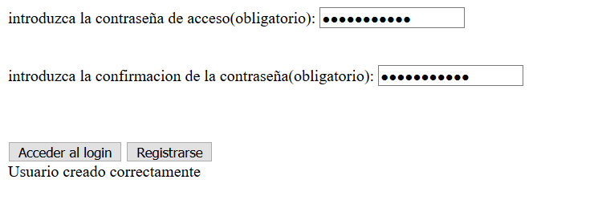

